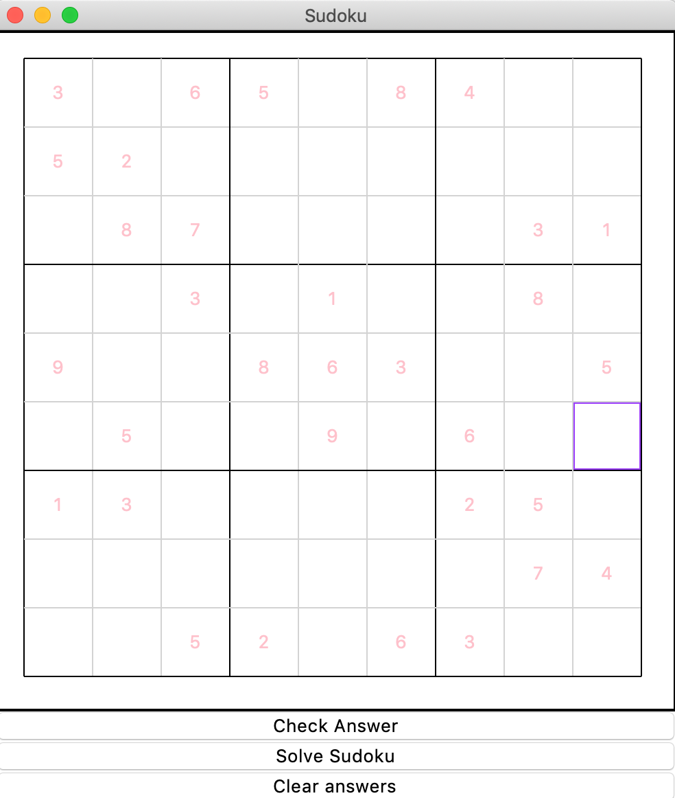

# sudoku_game
Author: Robert Zhang 

Date: 02/22/2020 

The sudoku program randomly initializes a random sudoku game that is 100% solvable, displays a GUI interface for the user to solve the sudoku game. If the user cannot solve the sudoku, the user can call the solver helper to help solve the sudoku.

The sudoku program utilizes object-oriented programing principles and data structure & algorithms for implementation of the solver and generator methods.
{:height="50%" width="50%"}

## Prerequisite
### Tools:
- Python 3
### Library:
- Tkinter

## Functionalities

- Generate a newly random Sudoku game
- Solve and validate a solution based on trial and error algorithm
